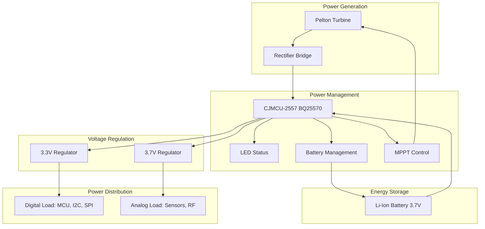
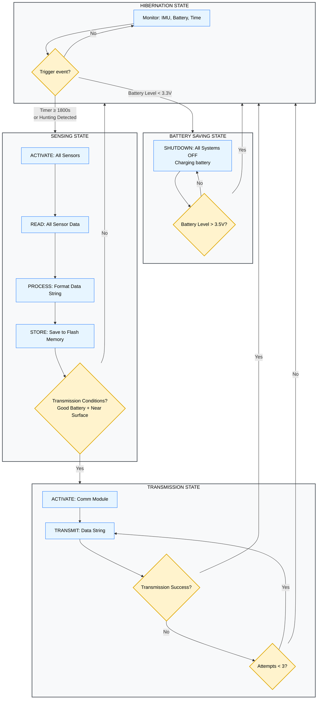
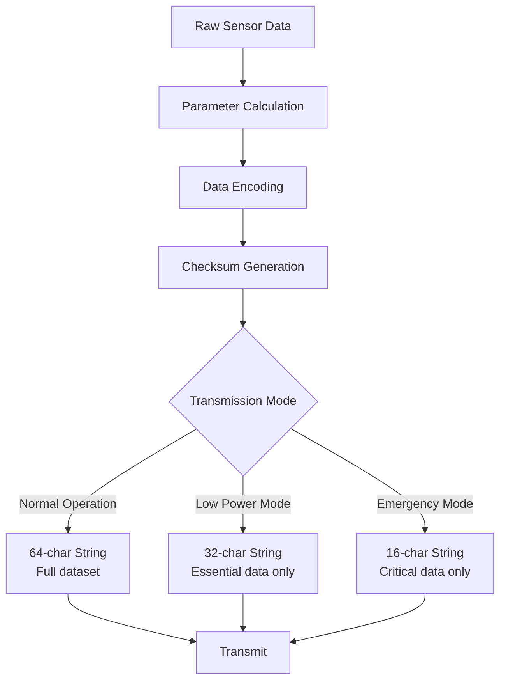

<!-- Guaya-->
# Power Subsystem Design


## System Operation
The autonomous power subsystem is designed to harvest hydraulic energy from water flow and deliver regulated power to the electronic tag. It employs a Pelton turbine driving a DC generator, with sophisticated power management provided by a CJMCU-2557 module featuring Maximum Power Point Tracking (MPPT) technology and Battery Management System (BMS) capabilities. This system efficiently converts variable hydraulic power into stable dual-voltage outputs - 3.3V for digital components and 3.7V for analog circuits - while intelligently managing battery charging and protection for completely self-sustained operation.

The power subsystem converts hydraulic energy from water flow into stable DC power for the electronic tag. A Pelton turbine drives a DC motor acting as a generator, producing variable DC electricity. This raw power passes through a rectifier bridge for polarity protection and basic conditioning before reaching the CJMCU-2557 module.

The CJMCU-2557 (BQ25570 IC) implements Maximum Power Point Tracking (MPPT) to extract optimal energy from the turbine while managing the 3.7V Li-Ion battery charging and protection. Dual independent regulators provide clean 3.3V for digital components and 3.7V for analog circuits, ensuring optimal performance for each load type.

## System Architecture




## Key Components

- **Pelton Turbine**: Hydraulic-to-electrical energy conversion
- **Rectifier Bridge**: Anti-backfeed protection and signal conditioning
- **CJMCU-2557 Module**: Integrated MPPT + battery management system
- **Li-Ion Battery**: 3.7V energy storage and system stabilization
- **Dual Regulators**: 3.3V and 3.7V buck-boost converters
- **Status LED**: Visual system operation indicator

## Design Philosophy & Robustness

### Power Separation Strategy
- **3.3V Rail**: Dedicated to noise-sensitive digital circuits (MCU, communication buses)
- **3.7V Rail**: Optimized for analog components and RF circuits requiring higher dynamic range

### Protection Mechanisms
- **Rectifier Bridge**: Prevents reverse current flow to turbine
- **Integrated BMS**: Built-in battery protection against overcharge/over-discharge
- **MPPT Algorithm**: Ensures maximum energy harvest from variable water flow
- **Independent Regulation**: Prevents cross-talk between digital and analog subsystems

### Fault Tolerance
- **Battery Backup**: Maintains operation during no-flow conditions
- **Voltage Regulation**: Stable outputs despite input fluctuations
- **Visual Monitoring**: LED provides immediate system status feedback

## Power Generation Scenarios

### Active Generation Mode
```
Water Flow → Turbine → Rectifier → CJMCU-2557 → Battery Charging + Load Power
```
*MPPT optimizes energy extraction while battery stores excess energy*

### Battery-Only Mode
```
Battery → CJMCU-2557 → Regulators → Load Power
```
*System maintains operation during periods of no water flow*

### Combined Operation
```
Turbine + Battery → CJMCU-2557 → Optimized Power Distribution
```
*Hybrid operation ensures stable power during flow variations*

## Critical Design Concepts

- **Energy Harvesting Optimization**: MPPT ensures maximum efficiency from low-power turbine output
- **Voltage Domain Isolation**: Separate rails prevent digital noise from affecting sensitive analog measurements
- **Graceful Degradation**: System maintains core functionality even under suboptimal generation conditions
- **Autonomous Operation**: No external power required - fully self-sustaining from hydraulic source

# Onboard Computer System

The Tag's control system implements an intelligent state machine that dynamically manages power consumption while ensuring reliable data collection and transmission. Operating through four distinct states, the system autonomously transitions based on environmental conditions, power availability, and behavioral triggers to maximize operational efficiency in marine environments.


## Operational States

### Hibernation State
*Ultra-low power monitoring mode*
- **Active Components:** IMU only
- **Monitored Parameters:** Acceleration patterns (hunting behavior), battery voltage, real-time clock
- **Exit Triggers:** 
  - 1800-second timer expiration
  - Hunting behavior detection via IMU patterns  
  - Critical battery level (< 3.3V)

### Battery Saving State  
*Emergency power conservation*
- **Active Components:** None (minimum systems)
- **Function:** Complete system shutdown during charging
- **Recovery:** Battery level > 3.5V

### Sensing State
*Comprehensive data acquisition*
- **Activated Sensors:** Pressure/temperature (MS5837), GPS (MAX-M10S), IMU (ICM-20948), magnetometer (HMC5883L), capacitive (FDC1004)
- **Data Pipeline:** Sensor activation → data collection → string formatting → flash storage
- **Transmission Check:** Evaluates battery level and surface proximity

### Transmission State
*Remote data communication*
- **Activated Systems:** Long-range communication module
- **Protocol:** 3-attempt retry mechanism with success/failure logging
- **Exit Conditions:** Successful transmission or exhausted retry attempts

## State Transition Logic



## System Reliability

### Robust Operation
- **Transmission Reliability:** 3-attempt retry mechanism with automatic hibernation fallback
- **Data Integrity:** Local flash storage preserves data during transmission failures
- **Power Management:** Hysteresis control (3.3V cutoff, 3.5V recovery) prevents system oscillation

### Decision Parameters
- **Hunting Detection:** IMU acceleration and orientation pattern analysis
- **Transmission Viability:** Battery adequacy and surface proximity assessment
- **State Transitions:** Condition-based routing ensures optimal resource allocation

## Performance Characteristics

The state machine architecture achieves optimal balance between:
- **Data Collection:** Comprehensive environmental and behavioral monitoring
- **Power Conservation:** Intelligent system activation/deactivation cycles  
- **Communication Reliability:** Environmentally-aware transmission timing
- **System Longevity:** Protected operation across variable power conditions

This design enables extended autonomous deployment in challenging marine environments while maximizing both data yield and operational reliability.

# Data Definition & Transmission Protocol

## Overview
The shark tag employs an efficient data management system that transforms raw sensor measurements into behavioral insights through real-time processing. Environmental and kinematic data are encoded into compact plain text strings (64-character normal mode) to ensure reliable transmission with minimal power consumption.

## Data Architecture

### Raw Sensor Measurements
**Direct hardware readings from onboard sensors:**

| Sensor | Data Type | Resolution | Range | Units |
|--------|-----------|------------|-------|-------|
| **MS5837** | Pressure | 0.01 mbar | 0-30 bar | mbar |
| **MS5837** | Temperature | 0.01°C | -20°C to +85°C | °C |
| **MAX-M10S** | Latitude | 0.000001° | ±90° | degrees |
| **MAX-M10S** | Longitude | 0.000001° | ±180° | degrees |
| **ICM-20948** | Acceleration | 0.001 g | ±16g | g |
| **HMC5883L** | Magnetic Field | 0.1 μT | ±8 Gauss | μT |
| **System** | Battery Voltage | 0.01 V | 3.0-4.2V | V |

### Behavioral Metrics
**Calculated parameters derived from sensor fusion:**

| Parameter | Calculation | Units | Behavioral Significance |
|-----------|-------------|-------|--------------|
| **Depth** | `(pressure - 1013.25) / 100` | meters | Diving patterns and depth preferences |
| **Speed** | `Δposition / Δtime` | m/s | Hunting activity and movement bursts |
| **Acceleration Magnitude** | `sqrt(ax² + ay² + az²)` | g | Movement intensity and energy expenditure |
| **Hunting Score** | Multi-parameter algorithm | 0-100 | Predation probability based on movement patterns |

## Transmission Protocol

### Data Format Specification
The system uses fixed-width plain text encoding for robust transmission:

```
TTTTSSSSPPPPBBBBGGGGLLLLAAAAIIIIMMMMDDDDHHHHXXXXYYYYZZZZRRRRCCCC
```

**Field Structure (4-character blocks):**
- `TTTT` (0-3): Time in HHMM format
- `SSSS` (4-7): Seconds of current minute  
- `PPPP` (8-11): Pressure (mbar × 10)
- `BBBB` (12-15): Battery voltage (mV)
- `GGGG` (16-19): Latitude (degrees × 1000)
- `LLLL` (20-23): Longitude (degrees × 1000)
- `AAAA` (24-27): Acceleration magnitude (g × 1000)
- `CCCC` (60-63): Checksum validation

### Real-World Example
**Transmitted String:**
```
1435002310123670+345-0760123405670890101520-015+020+9800850421
```

**Decoded Values:**
- **Time:** 14:35:23 UTC
- **Pressure:** 1012.3 mbar → ~0.9m depth
- **Position:** 34.5°N, 76.0°W
- **Battery:** 3.670V (healthy)
- **Activity:** Low acceleration (0.123g) with 85/100 hunting score

## Data Processing Pipeline



### Adaptive Transmission Modes
| Mode | Data Length | Content | Trigger Conditions |
|------|-------------|---------|-------------------|
| **Normal** | 64 characters | Complete sensor suite + behavioral metrics | Optimal battery + surface proximity |
| **Low Power** | 32 characters | Position, depth, battery, time only | Battery conservation required |
| **Emergency** | 16 characters | Critical position and status data | System fault or critical power |

This protocol ensures researchers receive comprehensive behavioral data while maintaining the tag's operational longevity through intelligent power-aware transmission strategies.
