# Mr Tagington Technical Documentation
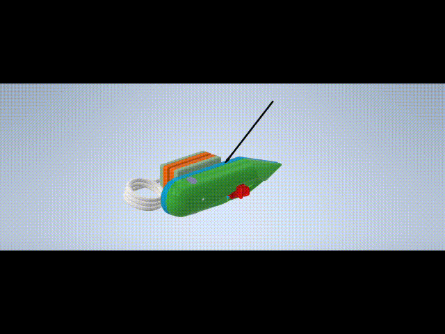


## Table of Contents
- [System Architecture](#system-architecture)
- [Electronic Specifications](#electronic-specifications)
- [Power Subsystem](#power-subsystem)
- [Onboard Computer](#onboard-computer)
- [Data & Communication](#data--communication)
- [Mechanical Structure](#mechanical-design)
- [PCB design & modelling](#pcb-design--modeling)

## System Architecture
The Mr Tagington device employs a modular dual-PCB architecture that physically separates power management from data processing functions, enabling optimized performance in challenging underwater environments. This separation allows for specialized design considerations: the power board focuses on robust energy harvesting and regulation, while the main processing board handles high-frequency sensor data acquisition and communication tasks.
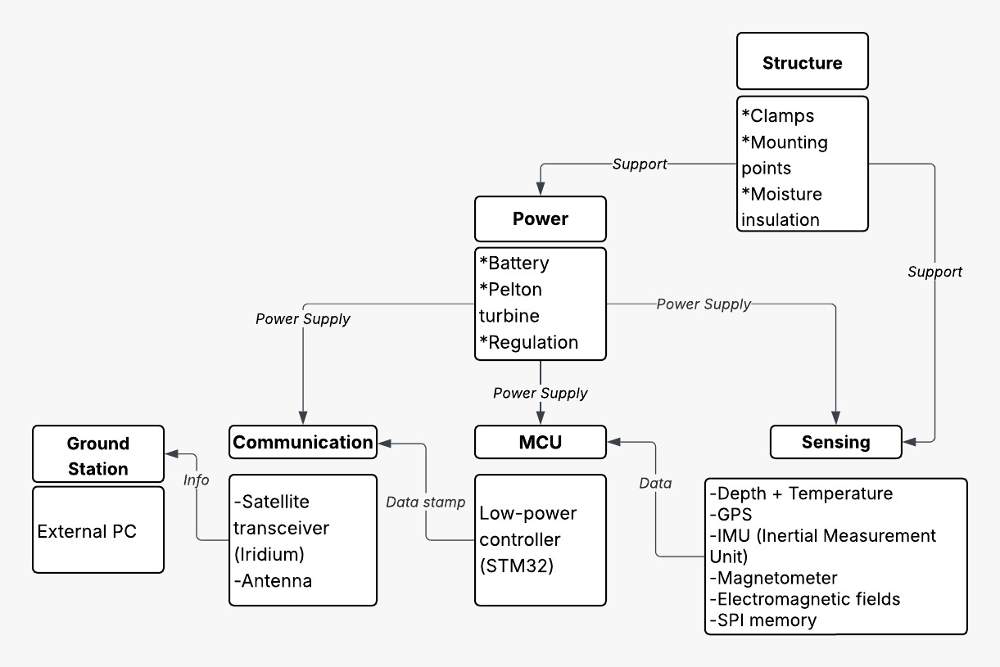


### Dual-PCB Design


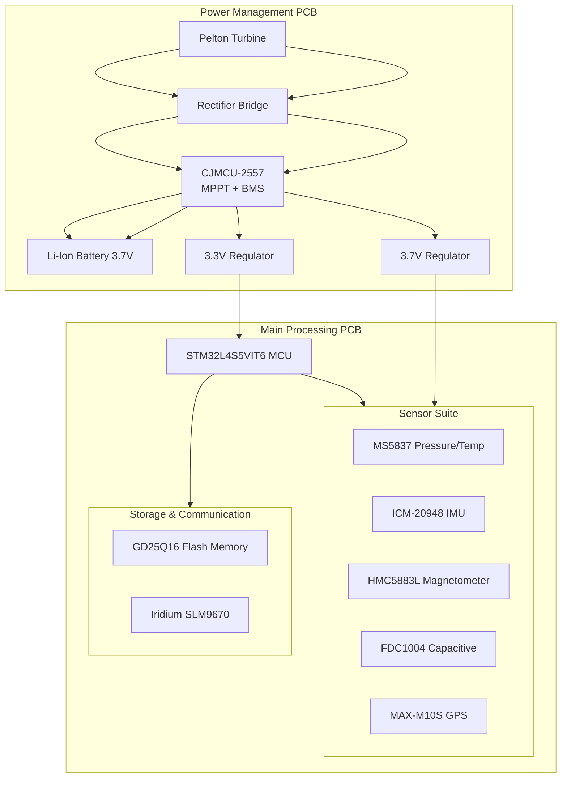

**Key Design Features:**
- **Power PCB**: Hydraulic energy harvesting, battery management, dual-voltage regulation
- **Main PCB**: Sensor processing, behavioral algorithms, data storage, satellite communication
- **Dedicated Power Rails**: 3.3V for digital, 3.7V for analog components

## Electronic Specifications

### Microcontroller & Processing

| Component | Specification | Key Features |
|-----------|---------------|--------------|
| **STM32L4S5VIT6** | ARM Cortex-M4 @ 120MHz | Ultra-low-power, Multiple communication interfaces, Floating-point unit |

### Environmental Sensors

| Sensor | Measurement | Range | Interface |
|--------|-------------|-------|-----------|
| **MS5837-02BA** | Pressure: 0-30 bar<br>Temperature: -20°C to +85°C | ±0.01 mbar<br>±0.01°C | I²C1 |
| **FDC1004DSCT** | Capacitance: 0-15 pF | ±0.1 fF | I²C2 |

### Motion & Orientation Sensors

| Sensor | Measurement | Range | Interface |
|--------|-------------|-------|-----------|
| **ICM-20948** | Acceleration: ±16g<br>Gyroscope: ±2000°/s<br>Magnetometer: ±4900 μT | 16-bit resolution | SPI1 |
| **HMC5883L** | Magnetic Field: ±8 Gauss | ±0.1 μT | I²C3 |

### Communication & Storage

| Component | Function | Specification | Interface |
|-----------|----------|---------------|-----------|
| **MAX-M10S-00B** | GPS Positioning | 2.5m accuracy | UART2 + EXTINT |
| **GD25Q16ESIGR** | Data Storage | 16 Mbit (2MB) | SPI2 |
| **Iridium SLM9670** | Satellite Comm | Global coverage | SPI2 + GPIO |

### Design Criteria & Implementation

### Bus Architecture Rationale

**Dedicated Communication Buses:**
- **I²C1**: MS5837 Pressure/Temperature sensor
- **I²C2**: FDC1004 Capacitive sensor  
- **I²C3**: HMC5883L Magnetometer
- **SPI1**: ICM-20948 IMU (high-speed data)
- **SPI2**: GD25Q16 Flash + Iridium module
- **UART2**: MAX-M10S GPS module

**Benefits of Dedicated Buses:**
- Eliminates bus contention and arbitration delays
- Enables simultaneous sensor operation
- Simplifies debugging and fault isolation
- Optimizes power consumption per peripheral

### Key Design Innovations

#### 1. Intelligent Sensor Activation

**Pressure-Triggered GPS Wake-up:**
- EXTINT pin (PC5) monitors pressure changes
- GPS activates only during surfacing events
- Eliminates constant GPS power drain underwater

#### 2. Redundant Magnetic Sensing

**Dual Magnetometer Configuration:**
- Primary: ICM-20948 integrated magnetometer
- Secondary: HMC5883L dedicated sensor
- Provides orientation backup and calibration reference

#### 3. Robust Mechanical Integration

**Environmental Protection:**
- MS5837 thermally exposed for accurate water temperature
- Capacitive sensors isolated from mechanical stress
- Multiple ground planes for RF performance
- Pressure-compensated enclosure design

### Pin Assignment & Connectivity

#### Microcontroller Interface Mapping

| Peripheral | Interface | Pins | Purpose |
|------------|-----------|------|----------|
| **MS5837** | I²C1 | PB6 (SCL), PB7 (SDA) | Pressure & Temperature |
| **FDC1004** | I²C2 | PB10 (SCL), PB11 (SDA) | Capacitive Sensing |
| **HMC5883L** | I²C3 | PC0 (SCL), PC1 (SDA) | Magnetic Field |
| **ICM-20948** | SPI1 | PA5 (SCK), PA6 (MISO),<br>PA7 (MOSI), PA4 (CS) | Motion & Orientation |
| **GD25Q16** | SPI2 | PB13 (SCK), PB14 (MISO),<br>PB15 (MOSI), PB12 (CS) | Data Storage |
| **MAX-M10S** | UART2 | PA2 (TX), PA3 (RX),<br>PC5 (EXTINT) | GPS + Wake-up |
| **Iridium** | SPI2 + Control | Shared SPI2, PB0 (RESET) | Satellite Communication |

### Performance Characteristics

#### Data Acquisition Capabilities

**Continuous Monitoring:**
- IMU sampling: 100-200 Hz for biomechanical analysis
- Environmental sensors: 1-10 Hz based on state machine
- Magnetic field: 10-50 Hz for orientation tracking

**Storage Capacity:**
- 2MB flash storage ≈ 2-4 weeks of continuous data
- Adaptive compression based on behavioral patterns
- FIFO management for long-term deployments

## Power Subsystem

### Energy Harvesting & Management
The autonomous power system converts hydraulic energy to stable DC power:

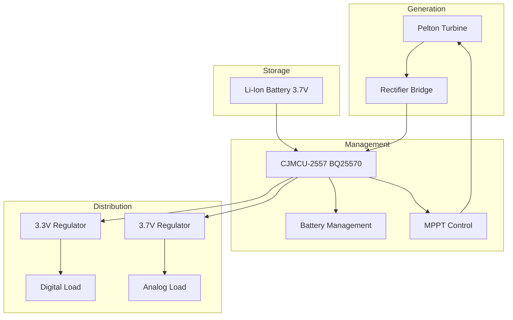

**Operational Modes:**
- **Active Generation**: Water flow → Turbine → Battery charging + load power
- **Battery-Only**: Battery → Regulators → Load power (no-flow conditions)
- **Combined**: Turbine + Battery → Optimized power distribution

**Key Components:**
- **Pelton Turbine**: Hydraulic-to-electrical conversion
- **CJMCU-2557**: Integrated MPPT + battery management
- **Dual Regulators**: 3.3V (digital) and 3.7V (analog) rails

## Onboard Computer
The onboard computer implements an intelligent state management system that dynamically optimizes the balance between data collection and power conservation through four distinct operational states. In Hibernation mode, the system maintains minimal power consumption by activating only the IMU for basic motion monitoring while tracking battery levels and time. This state serves as the default operational mode, consuming less than 500μA while waiting for activation triggers. When battery levels drop below 3.3V, the system transitions to Battery Saving mode, performing a complete shutdown of all non-essential systems to conserve energy until sufficient power is recovered. Activation events—either time-based (1800-second intervals) or behavior-triggered (hunting pattern detection)—prompt transition to Sensing state, where all environmental, motion, and position sensors are activated for comprehensive data collection, processing, and local storage. Finally, when conditions permit (adequate battery, surface proximity, and satellite availability), the system enters Transmission state, activating the satellite communication module and implementing a robust three-attempt retry protocol to ensure successful data delivery before returning to hibernation. This state machine architecture enables extended autonomous operation by ensuring that power-intensive components are activated only when necessary and for minimal durations.

### State Management System
The control system implements an intelligent state machine for optimal power and data management:

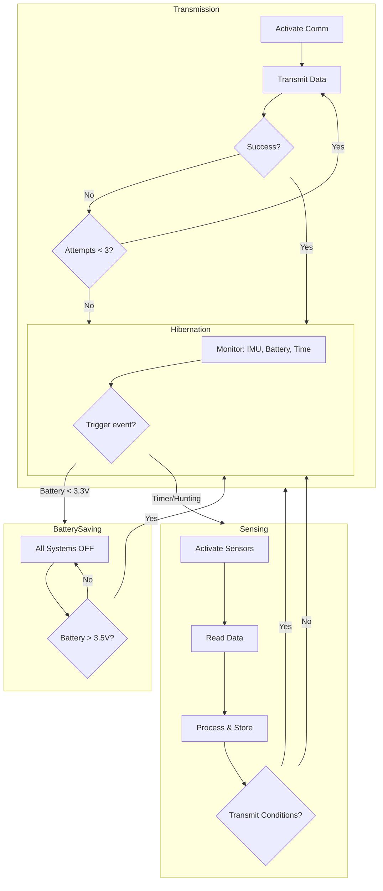

**Operational States:**
- **Hibernation**: IMU-only monitoring, ultra-low power
- **Battery Saving**: Complete shutdown, emergency conservation
- **Sensing**: Full sensor activation and data collection
- **Transmission**: Satellite communication with retry logic

## Data & Communication
The data and communication system integrates a comprehensive sensor suite—including pressure, temperature, motion, magnetic field, and GPS sensors—that captures both environmental conditions and behavioral metrics. Raw sensor data is processed into calculated parameters such as depth, speed, and hunting probability, then encoded into efficient 64-character plain text strings for transmission. The system employs adaptive transmission modes, scaling from full datasets during optimal conditions to essential-only data during power conservation. 

### Sensor Suite & Processing

| Category | Component | Measurements | Interface |
|----------|-----------|-------------|-----------|
| **Environmental** | MS5837 | Pressure (0-30 bar), Temperature (-20°C to +85°C) | I²C1 |
| **Motion** | ICM-20948 | Acceleration (±16g), Gyroscope (±2000°/s) | SPI1 |
| **Magnetic** | HMC5883L | Magnetic field (±8 Gauss) | I²C3 |
| **Position** | MAX-M10S | GPS positioning | UART2 |
| **Storage** | GD25Q16 | 2MB data storage | SPI2 |
| **Communication** | Iridium SLM9670 | Global satellite transmission | SPI2 |

**Calculated Behavioral Metrics:**
- **Depth**: `(pressure - 1013.25) / 100` meters
- **Speed**: Position delta over time (m/s)
- **Hunting Score**: Multi-parameter movement analysis
- **Activity Index**: Acceleration magnitude and patterns

### Data Transmission Protocol
The following pipeline is designed for data transmission:

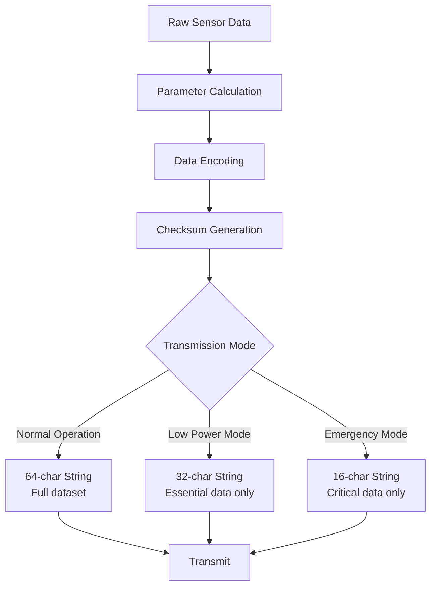

**Fixed-Width Encoding (64-character):**
```
TTTTSSSSPPPPBBBBGGGGLLLLAAAAIIIIMMMMDDDDHHHHXXXXYYYYZZZZRRRRCCCC
```

**Data Structure:**
- `TTTT`: Time (HHMM), `SSSS`: Seconds, `PPPP`: Pressure (mbar×10)
- `BBBB`: Battery (mV), `GGGG/LLLL`: Latitude/Longitude (degrees×1000)
- `AAAA`: Acceleration (g×1000), `CCCC`: Checksum

**Adaptive Transmission Modes:**
- **Normal** (64 chars): Full dataset when surfacing + good power
- **Low Power** (32 chars): Essential data during conservation
- **Emergency** (16 chars): Critical status during faults

### Design Innovations

**Bus Architecture:**
- Dedicated I²C/SPI buses per sensor eliminate contention
- Simultaneous operation and simplified debugging
- Optimized power consumption per peripheral

**Intelligent Activation:**
- Pressure-triggered GPS wake-up (EXTINT pin)
- Dual magnetometer configuration for redundancy
- Event-driven sensor activation based on behavioral triggers

**Environmental Robustness:**
- IP68-rated pressure-compensated enclosure
- Thermally exposed sensors for accurate measurements
- Corrosion-resistant materials for marine deployment

This integrated system enables long-term autonomous monitoring of shark behavior through optimized power management, comprehensive sensing, and reliable satellite communication.


## Mechanical Design

### Structural Components

- **Hull**:  Base of the FDM-3D printed structural core. Manufactured in PLA with 100% infill for structural integrity and water-proofed with a coat of Vinyl Ester Resin. Holds the electrical components on the inside and the attatchment to the torsional spring on the outside.
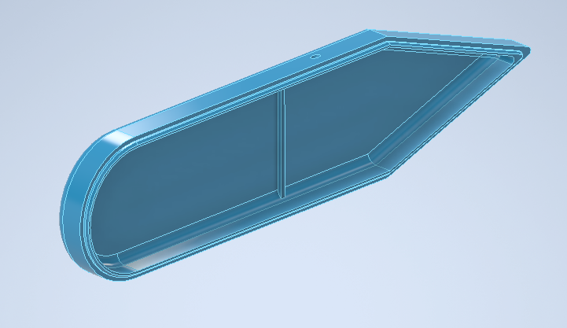
- **Cover**: Cover of the FDM-3D printed structural core, complimentary to teh Hull with lip interlocking. Manufactured in PLA with 100% infill for structural integrity and water-proofed with a coat of Vinyl Ester Resin. Holds the snesors in contact to the outside and both the housing and rotational seal for the pelton turbine axle.
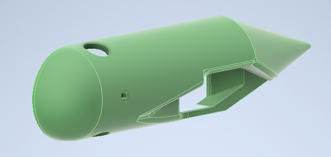
- **Pad Holds**: FDM-3D printed supports for the grip pads that non-invasively attatch to the sharks dorsal fin. Manufactured in PLA with 100% infill and water-proofed with a coat of Vinyl Ester Resin, these recieve the torsional spring and attatch to the silicone pads through an cyanoacrylate adhesive.
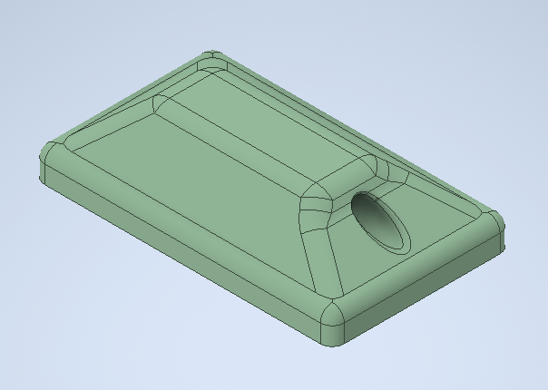
- **Pelton Turbine**: FDM-3D printed Pelton turbina compatible with dc motor axle. Manufactured in PLA with 100% infill and and water-proofed with a coat of Vinyl Ester Resin, this component transforms the water flow along the surface of the tag into energy for the tag through a DC motor and the power system.
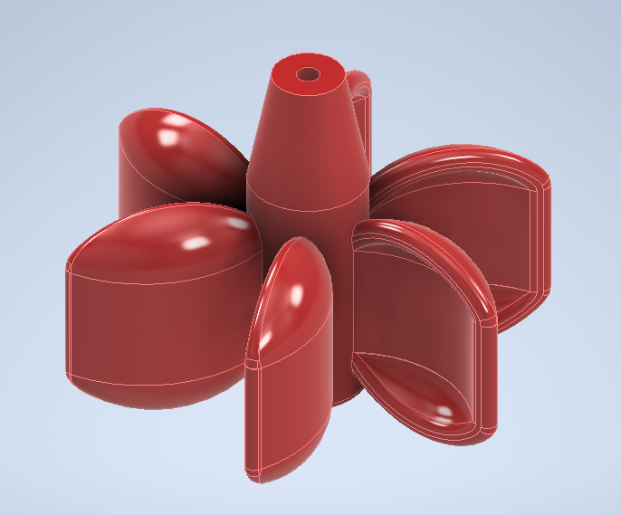
- **GFRP Skin**: 2mm thick skin of Glass Fiber Reinforced Polymer applied over the hole structured and binded to the nucleus through Vinyl Ester Resin. Manufactured from glass fiber symmetric plain weave and a Vinyl Ester Resin matrix, it handles the direct structural load due to external pressure and is supported angainst bukling by the PLA 3D printed nucleus.

### Design Criteria

#### Marine Environment Considerations
- **Corrosion Resistance**: Materials and coatings suitable for saltwater exposure
- **Pressure Tolerance**: Structural integrity at operational depths
- **Biofouling Mitigation**: Surface treatments to prevent marine growth
- **UV Degradation**: Protection against sunlight exposure during surface intervals

#### Operational Requirements
- **Attachment Security**: Reliable mounting without animal harm
- **Hydrodynamic Efficiency**: Minimal impact on shark swimming performance
- **Durability**: Long-term deployment capability in harsh conditions
- **Serviceability**: Reasonable maintenance and component access
- **Manufacturing Scalability**: Easy to manufacture via 3D printing prototyping and scalable to mission requirements

#### Design Constraints
- **Size Limitations**: Maximum dimensions for target shark species
- **Weight Budget**: Buoyancy and drag considerations
- **Manufacturing Feasibility**: Practical production within available resources
- **Regulatory Compliance**: Animal welfare and environmental regulations

### Mechanical Design - Enclosure Structure

#### Structural Approach with Reinforcement
*[Details on enclosure design strategy, reinforcement methods, and load distribution will be documented here]*

#### Aerodynamic Profile Design
- **Streamlined Geometry**: Aerodynamic profile designed to minimize drag in the direction of movement
- **Energy Generation Integration**: Profile allows for energy generation component to extend mission duration
- **Flow Optimization**: Shape optimized for minimal hydrodynamic resistance during shark locomotion

#### Pressure Design Calculations
*[Engineering calculations for depth pressure resistance, safety factors, and structural analysis will be included]*

#### 3D Printing Development
*[Additive manufacturing considerations, material selection, print orientation, and post-processing requirements will be specified]*

### Mechanical Design - Attachment System

#### Non-Invasive Coupling Approach
*[Clamp mechanism design philosophy, padding materials, and animal safety features will be described]*

#### Torsional Spring Mechanism
- **Non-Invasive Retention**: Torsional spring avoids resorting to invasive attachment methods
- **Controlled Pressure**: Silicon grip pads ensure low crushing pressure prevents detachment by drag
- **Animal Safety**: Designed to guarantee no unnecessary harm to sharks while maintaining secure attachment

#### Spring Calculations and Grip Pad Sizing
*[Mechanical spring design, force calculations, contact pressure distribution, and pad dimensioning will be detailed]*

### Mechanical Design - Pelton Turbine

#### Turbine Configuration
*[Turbine blade design, flow optimization, and energy conversion efficiency analysis will be presented]*


### Structural Components

*[List of mechanical components and materials will be added once information is received from mechanical team]*

### Design Criteria

#### Marine Environment Considerations
- **Corrosion Resistance**: Materials and coatings suitable for saltwater exposure
- **Pressure Tolerance**: Structural integrity at operational depths
- **Biofouling Mitigation**: Surface treatments to prevent marine growth
- **UV Degradation**: Protection against sunlight exposure during surface intervals

#### Operational Requirements
- **Attachment Security**: Reliable mounting without animal harm
- **Hydrodynamic Efficiency**: Minimal impact on shark swimming performance
- **Durability**: Long-term deployment capability in harsh conditions
- **Serviceability**: Reasonable maintenance and component access

#### Design Constraints
- **Size Limitations**: Maximum dimensions for target shark species
- **Weight Budget**: Buoyancy and drag considerations
- **Manufacturing Feasibility**: Practical production within available resources
- **Regulatory Compliance**: Animal welfare and environmental regulations

### Mechanical Design - Enclosure Structure

#### Structural Approach with Reinforcement
*[Details on enclosure design strategy, reinforcement methods, and load distribution will be documented here]*

#### Pressure Design Calculations
*[Engineering calculations for depth pressure resistance, safety factors, and structural analysis will be included]*

#### 3D Printing Development
*[Additive manufacturing considerations, material selection, print orientation, and post-processing requirements will be specified]*

### Mechanical Design - Attachment System

#### Non-Invasive Coupling Approach
*[Clamp mechanism design philosophy, padding materials, and animal safety features will be described]*

#### Spring Calculations and Grip Pad Sizing
*[Mechanical spring design, force calculations, contact pressure distribution, and pad dimensioning will be detailed]*

### Mechanical Design - Pelton Turbine

#### Turbine Configuration
*[Turbine blade design, flow optimization, and energy conversion efficiency analysis will be presented]*


## PCB Design & Modeling

The electronic systems were implemented through comprehensive PCB design and 3D modeling, following the modular dual-PCB architecture described in the system specifications. Both boards were fully designed, routed, and validated virtually, with detailed 3D models created to verify mechanical integration and environmental compatibility.


### Main Processing PCB Design
The main board design integrates the complete sensor suite, processing core, and communication systems with emphasis on signal integrity and EMI mitigation in the virtual environment.


#### Schematic Design
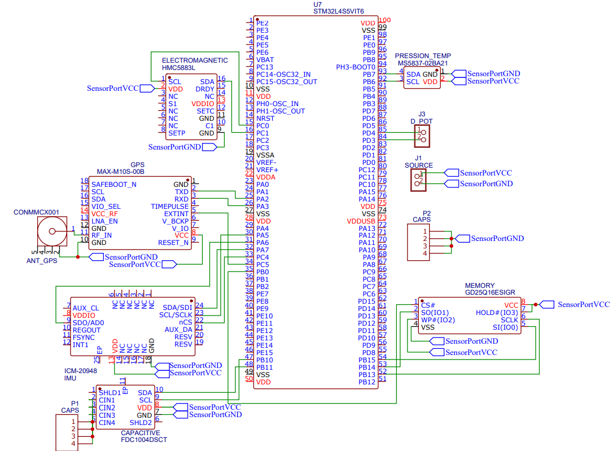
*Comprehensive schematic showing microcontroller implementation and sensor interfaces*


#### 3D Model
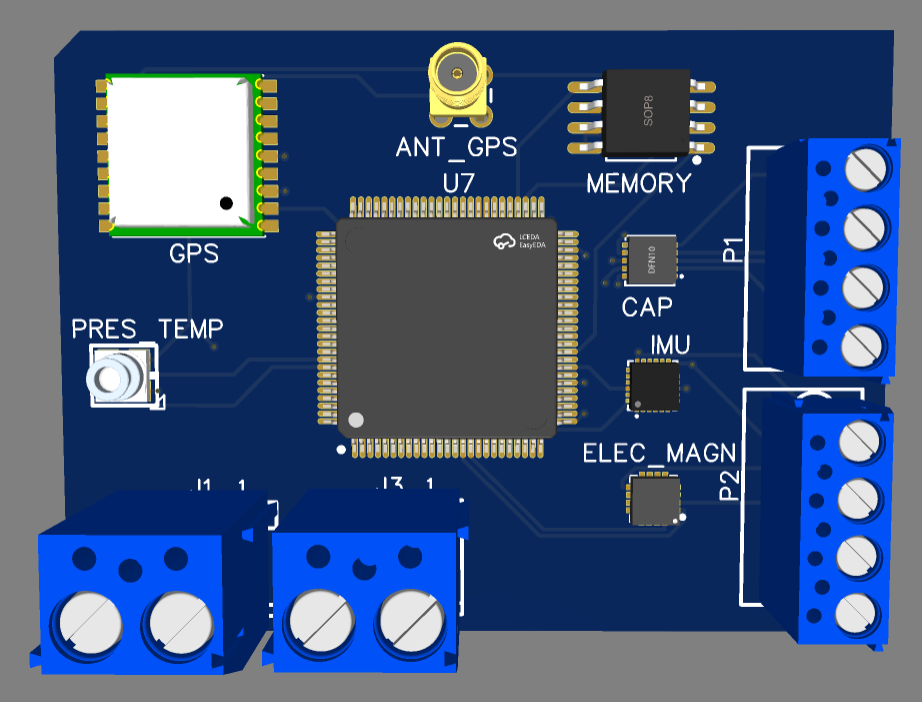
*3D model illustrating component clearance and mechanical mounting points*

### Power PCB
The power board design integrates the complete energy harvesting system, MPPT and BMS.
#### Schematic Design
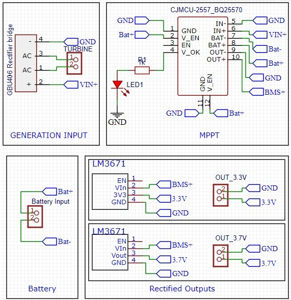

*Comprehensive schematic showingpower subsystem*


#### 3D Model
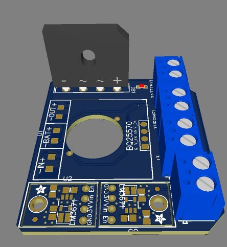

*3D model illustrating component clearance and mechanical mounting points*


Both PCB designs underwent extensive design rule checking, signal integrity simulation, and 3D mechanical validation to ensure the theoretical design meets all electrical and mechanical requirements for marine environment operation. The virtual prototyping approach allowed for comprehensive optimization of the system architecture before physical implementation.
